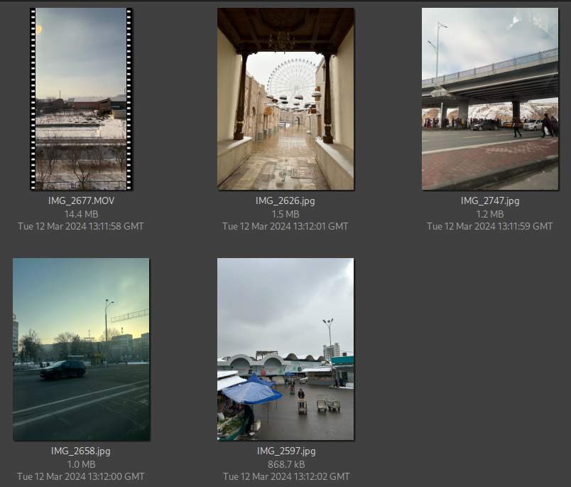

# Exercise 026 - OSInt

**Task briefing:**  

The image below shows the contents of a [zip file](./osintexercise026.zip). Inside you will find a 31-second video recorded during a train ride, and four photos of undisclosed locations. They were all taken by the same individual in February 2024. Despite having no useful metadata, they still contain enough information to track down this person’s movements.

Your task is to determine:

At which train stations did the person board and alight?

**Bonus challenges:**

- Identify the mode of transportation in each image.
- Determine the type of train they rode.
- Estimate the speed at which the train was travelling when the footage was recorded.
- Calculate approximately how far did the person travel overall.

## Solution

I narrowed down the area to be in Uzbekistan because I found Uzbek language in the following image.

The next image below shows a coffee shop, Halva Art Cafe Shop. It's location was found to be in Tashkent, Uzbekistan.

