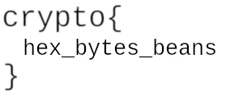

# Bean Counter

I've struggled to get PyCrypto's counter mode doing what I want, so I've turned ECB mode into CTR myself. My counter can go both upwards and downwards to throw off cryptanalysts! There's no chance they'll be able to read my picture.  

Play at [Bean Counter](https://aes.cryptohack.org/bean_counter)

## Description

I've struggled to get PyCrypto's counter mode doing what I want, so I've turned ECB mode into CTR myself. My counter can go both upwards and downwards to throw off cryptanalysts! There's no chance they'll be able to read my picture.


##### Help

This page offers a convenient way for you to interact with the challenge functions. You can also use GET requests to send and receive data directly from the listed routes/endpoints if you wish. For more information see the [FAQ](https://cryptohack.org/faq#blockciphers).

Your aim is to recover the `FLAG` value. Once you have it, submit it on the [CryptoHack Symmetric Ciphers page](https://cryptohack.org/challenges/aes).

### Source

```python
from Crypto.Cipher import AES


KEY = ?


class StepUpCounter(object):
    def __init__(self, step_up=False):
        self.value = os.urandom(16).hex()
        self.step = 1
        self.stup = step_up

    def increment(self):
        if self.stup:
            self.newIV = hex(int(self.value, 16) + self.step)
        else:
            self.newIV = hex(int(self.value, 16) - self.stup)
        self.value = self.newIV[2:len(self.newIV)]
        return bytes.fromhex(self.value.zfill(32))

    def __repr__(self):
        self.increment()
        return self.value


@chal.route('/bean_counter/encrypt/')
def encrypt():
    cipher = AES.new(KEY, AES.MODE_ECB)
    ctr = StepUpCounter()

    out = []
    with open("challenge_files/bean_flag.png", 'rb') as f:
        block = f.read(16)
        while block:
            keystream = cipher.encrypt(ctr.increment())
            xored = [a^b for a, b in zip(block, keystream)]
            out.append(bytes(xored).hex())
            block = f.read(16)

    return {"encrypted": ''.join(out)}
```

## Solution

The source code contains one function `encrypt` with no parameters that returns the encrypted data of [`bean_flag.png`](./bean_flag.png). The class `StepUpCounter` seems to generate a 16 byte value that will be fed to the block cipher to generate a keystream. The `step_up` value in the class is set to `False` which means the value generated by the class is always equal and hence the keystream is equal. 

Hence, once we find the keystream, we can XOR it with the ciphertext 16 byte blocks at a time and get the plaintext. Now we know that the first 16 bytes of a PNG constitutes it's file signature. So if we XOR it with the ciphertext, we will get the keystream.

Complete solution is given in [`solve.py`](./solve.py).

```bash
$ python3 solve.py
bean_flag.png created
```



## Answer

`crypto{hex_bytes_beans}`
