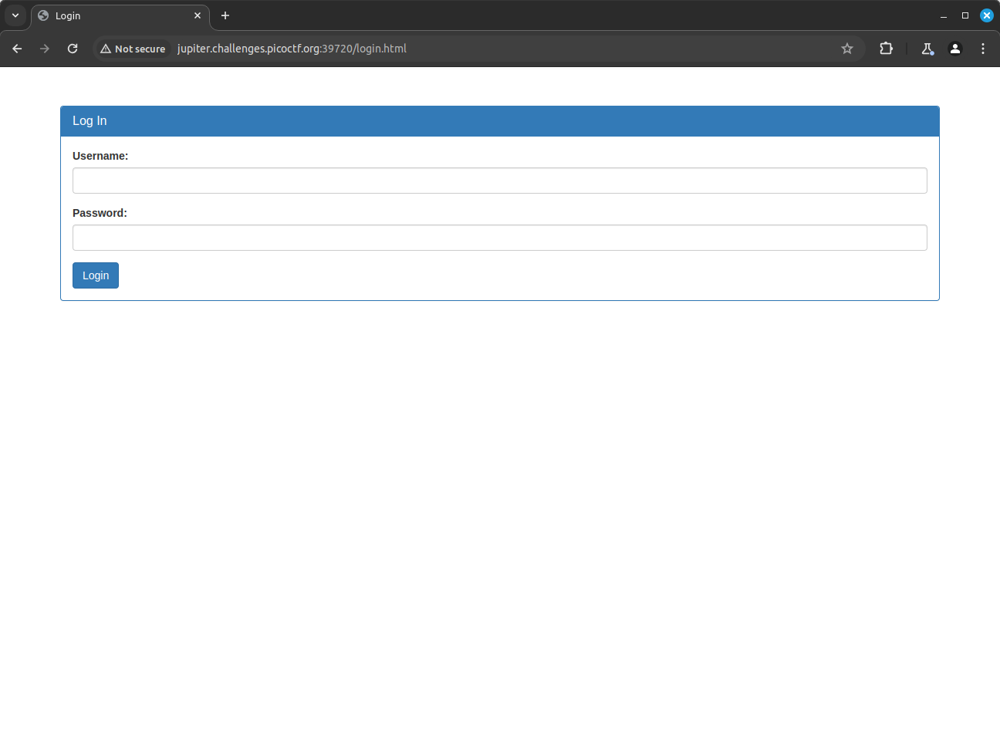
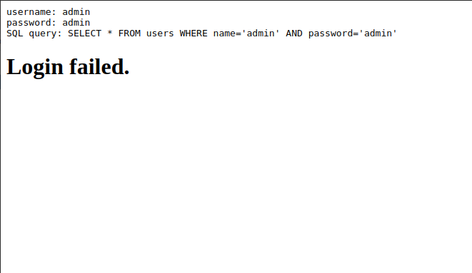
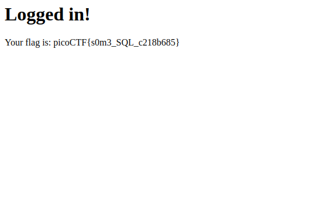

# Irish-Name-Repo 1

## Description

There is a website running at https://jupiter.challenges.picoctf.org/problem/39720/ ([link](https://jupiter.challenges.picoctf.org/problem/39720/)) or http://jupiter.challenges.picoctf.org:39720. Do you think you can log us in? Try to see if you can login!

#### Hints:

- There doesn't seem to be many ways to interact with this. I wonder if the users are kept in a database?
- Try to think about how the website verifies your login.

## Solution

The link opens up to a website as shown below...


The description says to login to the page. The sidebar option in the corner allows us to move to a login page as shown below...



I tried using credentials `username: admin, password: admin` and the website said login failed.


 I logged the POST request sent.

```
POST /login.php HTTP/1.1
Host: jupiter.challenges.picoctf.org:39720
Content-Length: 37
Cache-Control: max-age=0
Upgrade-Insecure-Requests: 1
Origin: http://jupiter.challenges.picoctf.org:39720
Content-Type: application/x-www-form-urlencoded
User-Agent: Mozilla/5.0 (Windows NT 10.0; Win64; x64) AppleWebKit/537.36 (KHTML, like Gecko) Chrome/125.0.6422.112 Safari/537.36
Accept: text/html,application/xhtml+xml,application/xml;q=0.9,image/avif,image/webp,image/apng,*/*;q=0.8,application/signed-exchange;v=b3;q=0.7
Referer: http://jupiter.challenges.picoctf.org:39720/login.html
Accept-Encoding: gzip, deflate, br
Accept-Language: en-GB,en-US;q=0.9,en;q=0.8
Connection: keep-alive

username=admin&password=admin&debug=0
```

I noticed a `debug` value being submit as `0` so I tried to intecept the request and changed the `debug` value to `1`. The login failed again but the change in the `debug` value caused the website to display the query being used in its database.



This means that I can perform an SQL injection easily to login to the website. I tried to login using username `admin' --` and arbitrary password and login was successful. The website gave me the flag.

The SQL query being used would then be `SELECT * FROM users WHERE name='admin' --' AND password='{arbitrary password}'`. The password field gets commented out and only the username being `admin` is used in the query.


