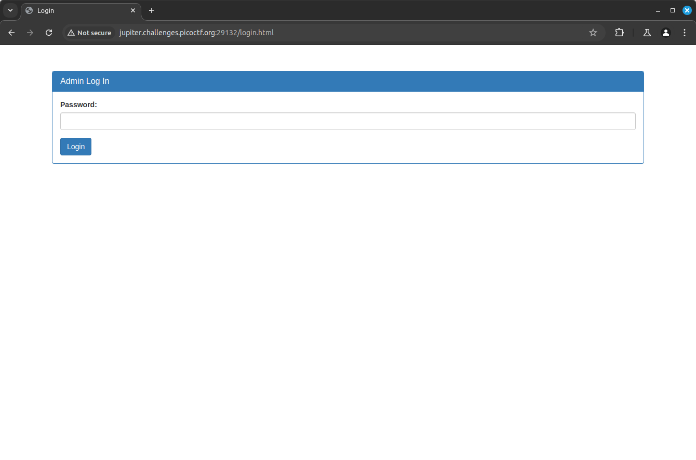
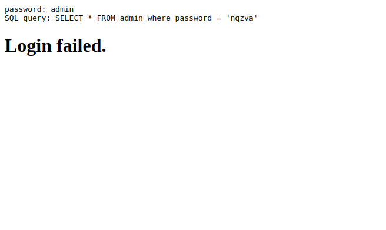
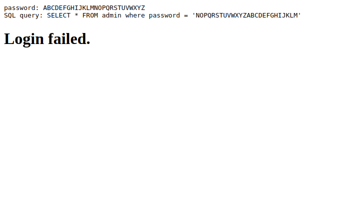
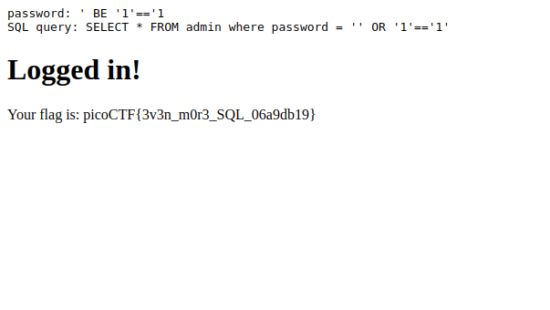

# Irish-Name-Repo 3

## Description

There is a secure website running at `https://jupiter.challenges.picoctf.org/problem/29132/` ([link](https://jupiter.challenges.picoctf.org/problem/29132/)) or http://jupiter.challenges.picoctf.org:29132. Try to see if you can login as admin!

#### Hints:

- Seems like the password is encrypted.

## Solution

The link opens up to a website as shown below...


The description says to login to the page. The sidebar option in the corner allows us to move to a login page as shown below...



I tried using credentials `password: admin` and the website said login failed.


 I logged the POST request sent.

```
POST /login.php HTTP/1.1
Host: jupiter.challenges.picoctf.org:29132
Content-Length: 22
Cache-Control: max-age=0
Accept-Language: en-GB
Upgrade-Insecure-Requests: 1
Origin: http://jupiter.challenges.picoctf.org:29132
Content-Type: application/x-www-form-urlencoded
User-Agent: Mozilla/5.0 (Windows NT 10.0; Win64; x64) AppleWebKit/537.36 (KHTML, like Gecko) Chrome/126.0.6478.57 Safari/537.36
Accept: text/html,application/xhtml+xml,application/xml;q=0.9,image/avif,image/webp,image/apng,*/*;q=0.8,application/signed-exchange;v=b3;q=0.7
Referer: http://jupiter.challenges.picoctf.org:29132/login.html
Accept-Encoding: gzip, deflate, br
Connection: keep-alive

password=admin&debug=0
```

I noticed a `debug` value being submit as `0` so I tried to intecept the request and changed the `debug` value to `1`. The login failed again but the change in the `debug` value caused the website to display the query being used in its database.



This means that I can perform an SQL injection to login to the website. But the twist is that the server is encrypting my input and then using it in the query. I tried using the password `ABCDEFGHIJKLMNOPQRSTUVWXYZ` to see if it is any simple substitution cipher.



I was right and it turned out to be a ROT13 cipher. Hence the password field should be `' BE '1'=='1`. The login worked and it gave me the flag.


